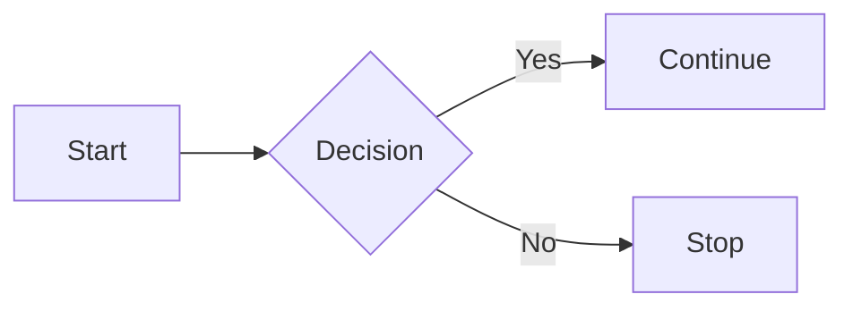

# Diagram

<!-- remarque:mermaid id="diagram-1" title="Flow" width="720" height="420" align="center" -->

```mermaid
flowchart LR
    A[Start] --> B{Decision}
    B -->|Yes| C[Continue]
    B -->|No| D[Stop]
```